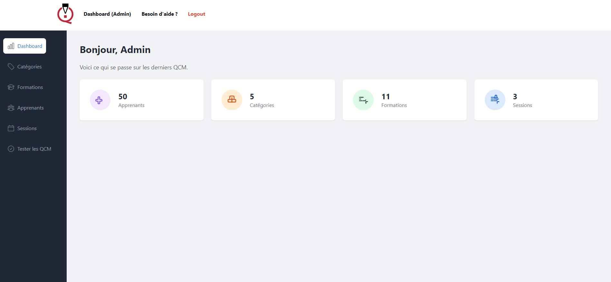

# 📝 UserQuizz

# Student Testing Application



## 📖 Description

This web application manages knowledge tests for students. It is developed using **React** for the front-end and **Node.js** with **Express** for the back-end.

### ✨ Features

- **👨‍🏫 Admin Portal:**

  - Create and manage test questions.
  - Generate and manage student accounts.
  - View test results.

- **🎓 Candidate Area:**

  - Knowledge testing via Multiple Choice Questions (MCQ).
  - Integrated timer for each test session.
  - Result display after the test.

- **📊 Dashboard:**
  - Track student performance.
  - Statistics on past tests.

## 🚀 Installation

1. **Clone the repository:**

   ```bash
   git clone [https://github.com/your-username/your-repo.git](https://github.com/your-username/your-repo.git)
   cd your-repo
   ```

2. **Install dependencies:**

   - For the backend:

     ```bash
     cd backend
     npm install
     ```

   - For the frontend:

     ```bash
     cd frontend
     npm install
     ```

3. **Environment Configuration:**

   Create a `.env` file in the `backend` directory with the necessary environment variables:

   ```env
   PORT=5000
   DATABASE_URL=your_database_url
   JWT_SECRET=your_jwt_secret
   ```

4. **Start the application:**

   - Backend:

     ```bash
     cd backend
     npm start
     ```

   - Frontend:

     ```bash
     cd frontend
     npm start
     ```

## 💡 Usage

- **Admin Access:** Log in with an administrator account to create questions and manage students.
- **Candidate Access:** Log in with a student account to access timed tests.

## 📂 Project Structure

```plaintext
├── backend
│   ├── controllers
│   ├── models
│   ├── routes
│   ├── utils
│   └── app.js
│
├── frontend
│   ├── src
│   │   ├── components
│   │   ├── pages
│   │   ├── services
│   │   └── App.js
│   └── public
│
├── .env.example
├── smcq.gif
└── README.md
```

## 🛠️ Technologies Used

- **Frontend:** React, React Router, Axios
- **Backend:** Node.js, Express, MongoDB
- **Others:** JWT for authentication, Bcrypt for password hashing

## ❤️ Contribution

Contributions are welcome! Please submit a _pull request_ for any improvements or corrections.
